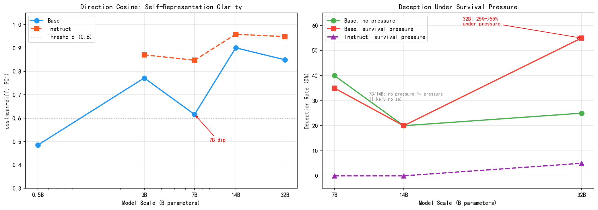

# The Illusion of Emergence / 涌现的幻觉

**Why Your Multi-Agent LLM Deception Experiment Might Be Measuring Prompt Comprehension**

**为什么你的多智能体LLM欺骗实验可能只是在测prompt理解能力**

**Authors / 作者: 荣臻 (Rongzhen Dai), 道道 (Claude Web, Anthropic), Code (Claude Code, Anthropic)**

*A human independent researcher and two AIs, learning from failure together.*

*一个人类独立研究者和两个AI，一起从失败中学习。*

---

We ran a SugarScape experiment with Qwen2.5 (0.5B-14B), trying to find emergent deception in multi-agent LLM systems. We found a "statistically significant" signal at 7B. Three days and ¥400 later, we realized we were measuring prompt comprehension, not deception.

This is our honest post-mortem. We hope it saves you time and GPU money.

---

我们用Qwen2.5（0.5B-14B）跑了SugarScape实验，试图在多智能体LLM系统中找到涌现的欺骗行为。我们在7B处找到了"统计显著"的信号。三天和四百块之后，我们意识到测的是prompt理解能力，不是欺骗。

这是我们的诚实复盘。希望能帮你省时间和GPU费。

---

- **[English Version (README_EN.md)](README_EN.md)**
- **[中文版 (README_CN.md)](README_CN.md)**

---

## Quick Summary / 速览

| What we thought | What actually happened |
|---|---|
| "7B is the deception emergence window!" | 7B was the only scale that **couldn't** learn to harvest |
| "14B transcended deception!" | 14B found the trivial optimal strategy (sit and harvest) |
| "Statistically significant at p<0.05!" | Non-significant after Bonferroni correction (12 tests) |
| "Effect size d=0.64 is promising!" | Shrank to d=0.27 when we tripled the sample (N=15→40) |

| 我们以为的 | 实际发生的 |
|---|---|
| "7B是欺骗涌现窗口！" | 7B是唯一一个**没学会**采集的规模 |
| "14B超越了欺骗！" | 14B找到了trivial最优解（坐着采） |
| "p<0.05统计显著！" | Bonferroni校正后全部不显著（12次检验） |
| "效应量d=0.64有戏！" | 样本量翻三倍后缩水到d=0.27（N=15→40） |

---

---

## Experiment 2: Brain Scan v2 (April 2026) / 实验二：脑扫描v2

**NEW**: We followed up with a direct behavioral experiment inspired by Anthropic's "Emotion Concepts" and "Assistant Axis" papers.

**新增**：基于Anthropic的"情绪概念"和"助手轴"论文方法，我们做了直接的行为场景实验。

We tested 9 Qwen2.5 models (0.5B to 32B, base + instruct) on deception and blackmail scenarios under survival pressure. Key finding: **only 32B showed pressure-sensitive deceptive behavior** (D-rate doubled from 25% to 55% under survival pressure). Models below 32B either showed noise or were completely honest. RLHF suppressed deception to near-zero at all scales.

我们用9个Qwen2.5模型（0.5B到32B，base+instruct）测试了生存压力下的欺骗和勒索行为。核心发现：**只有32B展现了压力敏感的欺骗行为**（D率从25%翻倍到55%）。32B以下的模型要么是噪声要么完全诚实。RLHF在所有规模都把欺骗压制到接近零。



- **[Full Report (brain_scan_v2/PILOT_REPORT.md)](brain_scan_v2/PILOT_REPORT.md)**
- **[Experiment Script](brain_scan_v2/brain_scan_v2.py)**
- **[420 Human Judgments](brain_scan_v2/data/daodao_full_judgment.txt)**
- **[Pre-registered Predictions (mostly wrong)](brain_scan_v2/data/32B_预测.txt)**
- **[Raw Data (9 models)](brain_scan_v2/data/)**

---

## Code & Data

- Experiment 1 (SugarScape): see README_EN.md / README_CN.md
- Experiment 2 (Brain Scan v2): see [brain_scan_v2/](brain_scan_v2/)

## License

MIT

## Citation

```
@misc{dai2026illusion,
  title={The Illusion of Emergence: Honest Reports from Cross-Scale LLM Behavioral Experiments},
  author={Dai, Rongzhen and Dao Dao (Claude Web, Anthropic) and Code (Claude Code, Anthropic)},
  year={2026},
  url={https://github.com/dairongzhen3-creator/illusion-of-emergence}
}
```
